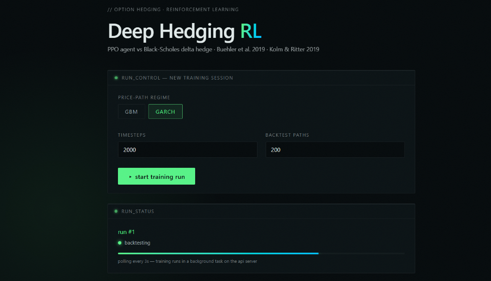
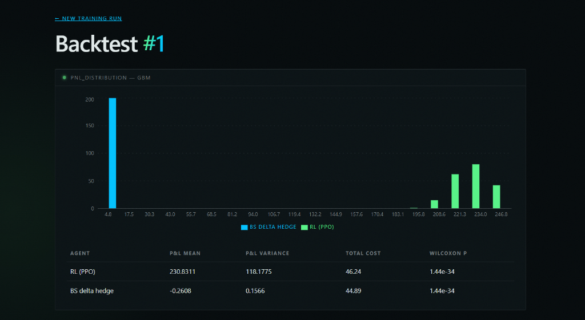
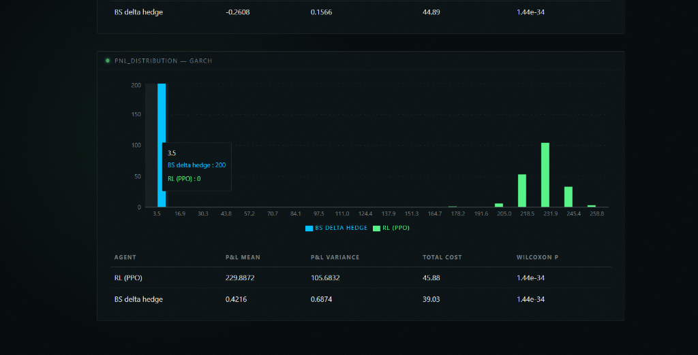

# RL-Derivative-Hedging

**Can a reinforcement-learning agent hedge a short option position better than the
Black-Scholes delta hedge — once transaction costs are real?**

A working deep-hedging pipeline, end to end: a Gymnasium environment that
simulates delta-hedging a short European call, a PPO agent trained with
Stable-Baselines3, a Black-Scholes baseline, a FastAPI job server, and a live
Next.js dashboard — all wired together and deployed.

[](https://github.com/Prad-Nanduri/RL-Derivative-Hedging/actions/workflows/ci.yml)
[](https://frontend-ecru-beta-49.vercel.app)

## Why this project

The Black-Scholes delta hedge is optimal only in a frictionless, continuously
rebalanced world. Real desks rebalance discretely and pay for every trade —
exactly the regime where the closed-form hedge loses its guarantees and a
learned policy can, in principle, do better: trade less often, tolerate more
inventory risk, and shape its P&L distribution instead of tracking delta.

That is the promise of *deep hedging* — and it is also a claim worth testing,
not assuming. This repo builds the honest version of the experiment: same
seeded price paths, same cost model, paired statistics, and a results table
that reports what the agent actually did rather than what we hoped it would do.

The formulation follows:

- **Buehler, Gonon, Teichmann & Wood (2019)**, "Deep Hedging",
  *Quantitative Finance* 19(8) — hedging as sequential decision-making under
  a convex risk measure; here the per-step reward is the negative squared
  incremental P&L minus proportional transaction costs.
- **Kolm & Ritter (2019)**, "Dynamic Replication and Hedging: A
  Reinforcement Learning Approach", *Journal of Financial Data Science* —
  RL hedging benchmarked against the Black-Scholes delta hedge under
  transaction costs.

## Live demo

- **Frontend (Vercel):** https://frontend-ecru-beta-49.vercel.app
- **Backend API (Render):** https://deep-hedging-rl-api.onrender.com —
  interactive OpenAPI docs at `/docs`

The backend runs on Render's free tier: expect ~60s cold-start on the first
request after idle, and keep training runs small (the 512MB plan limits large
PPO jobs — run heavy training locally).

| Training console | Backtest — GBM | Backtest — GARCH |
|------------------|----------------|------------------|
|  |  |  |

## Architecture


- **`env/hedging_env.py`** — `HedgingEnv(gym.Env)`. Continuous Box observation
  (spot ratio, time-to-expiry, current hedge position, realized vol) and
  continuous Box action (hedge-position adjustment, clipped to `[0, 1]` with a
  per-step adjustment cap). Reward per step:
  `-(incremental P&L)² - cost_rate · |trade| · S`, the tractable stand-in for
  the convex-risk-measure objective in Buehler et al. Episode = one option
  lifetime, settling the call payoff at expiry.
- **`sim/price_paths.py`** — GBM and GARCH(1,1) (`arch`) path simulators;
  the GARCH regime makes the market non-Markovian so the baseline's
  constant-volatility assumption actually hurts.
- **`pricing/black_scholes.py`** — hand-rolled BS price + delta (unit-tested
  against put-call parity).
- **`baseline/delta_hedge.py`** — rebalances to BS delta each step, paying the
  same proportional cost as the agent.
- **`training/train_ppo.py`** — PPO (Stable-Baselines3) on `DummyVecEnv`;
  model → `models/`, TensorBoard → `runs/`.
- **`evaluation/backtest.py`** — paired seeded paths through both regimes for
  RL vs baseline, paired t-test + Wilcoxon signed-rank on P&L; writes JSON +
  markdown table.
- **`backend/main.py`** — `POST /train` (FastAPI `BackgroundTasks`),
  `GET /train/{id}/status`, `GET /backtest/{id}`; metadata in SQLite via
  SQLAlchemy (`db/models.py`).
- **`frontend/`** — Next.js 14 + TypeScript + Tailwind + Recharts; training
  console and per-run backtest dashboards.
- **`tests/`** — pytest: hand-computed reward cases, simulated-path sanity
  (positivity, terminal moments), BS put-call parity, API schema via
  `TestClient`.

## Run it yourself

### Prerequisites

- Python 3.11, Node.js 20+
- (Recommended) `uv` for the Python env: `pip install uv`

### 1. Backend

```bash
# from the repo root
uv venv --python 3.11 .venv
uv pip install --python .venv/Scripts/python.exe \
  --extra-index-url https://download.pytorch.org/whl/cpu -r requirements.txt
# (Linux/macOS: .venv/bin/python instead of .venv/Scripts/python.exe)

# run the API
.venv/Scripts/python.exe -m uvicorn backend.main:app --reload
```

### 2. Frontend

```bash
cd frontend
cp .env.example .env.local        # NEXT_PUBLIC_API_URL=http://localhost:8000
npm ci && npm run dev             # http://localhost:3000
```

### 3. Train + backtest directly (no server needed)

```bash
# train a PPO hedging agent on the GBM regime
.venv/Scripts/python.exe training/train_ppo.py --timesteps 50000 --regime gbm
tensorboard --logdir runs

# paired backtest, both regimes, seeded paths
.venv/Scripts/python.exe evaluation/backtest.py --model models/ppo_hedging.zip --n-paths 200
# → results/backtest_results.json + results/backtest_table.md
```

### 4. API endpoints

```bash
curl -X POST localhost:8000/train -H 'Content-Type: application/json' \
  -d '{"regime":"gbm","timesteps":50000,"n_paths_backtest":200}'
# → {"run_id": 1, "status": "queued"}

curl localhost:8000/train/1/status    # {"status": "training", "progress": 0.42, ...}
curl localhost:8000/backtest/1        # regime → {rl, baseline} stats + pnl_samples
```

### 5. Tests

```bash
.venv/Scripts/python.exe -m pytest tests -q
```

## Results

Actual run: PPO trained for 50k timesteps on the GBM regime, then backtested
against the Black-Scholes delta hedge on 200 seeded paths per regime
(`python evaluation/backtest.py --n-paths 200`).

| Regime | Agent | P&L mean | P&L var | Total cost | Wilcoxon p-value |
|--------|-------|----------|---------|------------|------------------|
| GBM | RL (PPO) | -1.3653 | 5.9432 | 279.92 | 2.2e-08 |
| GBM | BS baseline | -0.2608 | 0.1566 | 44.89 | 2.2e-08 |
| GARCH | RL (PPO) | -0.8178 | 4.0000 | 283.81 | 2.8e-19 |
| GARCH | BS baseline | 0.5100 | 0.5439 | 39.39 | 2.8e-19 |

**Honest read:** at this training budget the PPO agent does **not** beat the
delta-hedge baseline — it over-trades (~6-7× the transaction cost) and shows
higher terminal P&L variance. Longer runs (150k–200k steps) exhibited PPO
collapse without hyperparameter tuning (reward rescaling / entropy
regularization), consistent with the instability reported for unregularized RL
hedging in the literature. Tuning is future work; the pipeline, evaluation
harness, and API are the deliverable of this MVP — and the harness is exactly
what you'd need to close the gap.

## Roadmap

- Reward shaping toward the exponential-utility / CVaR objective in Buehler et
  al., with entropy regularization to prevent late-run policy collapse
- Option-aware observations (BS greeks as features) and action parameterization
  in hedge *units* rather than adjustments
- Additional simulators (Heston, regime-switching vol) behind the same
  `price_paths` interface
- SAC/other off-policy agents through the same `HedgingEnv`

## References

- Buehler, H., Gonon, L., Teichmann, J., & Wood, B. (2019). *Deep hedging*.
  Quantitative Finance, 19(8), 1271–1291.
- Kolm, P. N., & Ritter, G. (2019). *Dynamic replication and hedging: A
  reinforcement learning approach*. Journal of Financial Data Science, 1(1),
  159–171.
