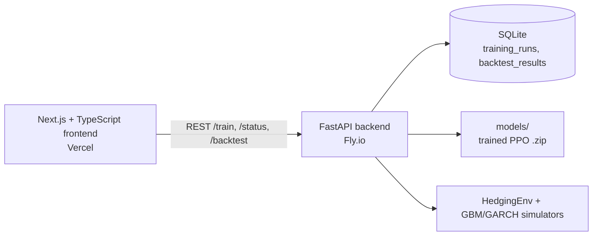

# RL-Derivative-Hedging

Deep Reinforcement Learning for option hedging: a Gymnasium environment that
simulates delta-hedging a short European call, a PPO agent trained with
Stable-Baselines3, a Black-Scholes delta-hedge baseline, and a FastAPI
backend that runs training/backtest jobs and serves results.

## Approach

The reward and problem formulation follow:

- **Buehler, Gonon, Teichmann & Wood (2019)**, "Deep Hedging",
  *Quantitative Finance* 19(8) — hedging as sequential decision-making under
  a convex risk measure; here the per-step reward is the negative squared
  incremental P&L minus proportional transaction costs.
- **Kolm & Ritter (2019)**, "Dynamic Replication and Hedging: A
  Reinforcement Learning Approach", *Journal of Financial Data Science* —
  RL hedging benchmarked against the Black-Scholes delta hedge under
  transaction costs.

## Architecture



## Frontend

`frontend/` — Next.js 14 (App Router), TypeScript, Tailwind, Recharts.

- `/` — regime selector (GBM/GARCH) + "start training run" form; POSTs to
  `/train` and polls `/train/{id}/status`.
- `/backtest/[id]` — side-by-side P&L distribution histograms (RL vs BS
  baseline) and a results table from `/backtest/{id}`.

```bash
cd frontend
cp .env.example .env.local   # set NEXT_PUBLIC_API_URL
npm ci && npm run dev
```

## Live demo

- Frontend: _pending deployment_
- Backend API: _pending deployment_

## Layout

| Path | Contents |
|------|----------|
| `env/hedging_env.py` | `HedgingEnv(gym.Env)` — continuous Box obs/action, transaction-cost-aware reward |
| `sim/price_paths.py` | `simulate_gbm`, `simulate_garch` (GARCH(1,1) via `arch`), `fit_garch` |
| `pricing/black_scholes.py` | Hand-rolled BS call/put price and delta |
| `baseline/delta_hedge.py` | BS delta-hedge baseline agent |
| `training/train_ppo.py` | PPO training (DummyVecEnv), model → `models/`, TensorBoard → `runs/` |
| `evaluation/backtest.py` | Paired backtest over seeded paths, both regimes, t-test + Wilcoxon |
| `backend/main.py` | FastAPI: `POST /train`, `GET /train/{id}/status`, `GET /backtest/{id}` |
| `db/models.py` | SQLAlchemy models (`TrainingRun`, `BacktestResult`), SQLite |
| `tests/` | pytest suite (reward, path sanity, put-call parity, API) |
| `frontend/` | Next.js 14 + TypeScript + Tailwind + Recharts dashboard |

## Setup

```bash
python -m venv .venv && source .venv/bin/activate   # or .venv\Scripts\activate
pip install -r requirements.txt
```

## Train

```bash
python training/train_ppo.py --timesteps 50000 --regime gbm
tensorboard --logdir runs
```

## Backtest

```bash
python evaluation/backtest.py --model models/ppo_hedging.zip --n-paths 200
# writes results/backtest_results.json and results/backtest_table.md
```

## API

```bash
uvicorn backend.main:app
curl -X POST localhost:8000/train -H 'Content-Type: application/json' \
  -d '{"regime":"gbm","timesteps":50000,"n_paths_backtest":200}'
curl localhost:8000/train/1/status
curl localhost:8000/backtest/1
```

## Tests

```bash
pytest tests -q
```

## Results

Actual run: PPO trained for 50k timesteps on the GBM regime, then backtested
against the Black-Scholes delta hedge on 200 seeded paths per regime
(`python evaluation/backtest.py --n-paths 200`).

| Regime | Agent | P&L mean | P&L var | Total cost | Wilcoxon p-value |
|--------|-------|----------|---------|------------|------------------|
| GBM | RL (PPO) | -1.3653 | 5.9432 | 279.92 | 2.2e-08 |
| GBM | BS baseline | -0.2608 | 0.1566 | 44.89 | 2.2e-08 |
| GARCH | RL (PPO) | -0.8178 | 4.0000 | 283.81 | 2.8e-19 |
| GARCH | BS baseline | 0.5100 | 0.5439 | 39.39 | 2.8e-19 |

Honest read: at this training budget the PPO agent does **not** beat the
delta-hedge baseline — it over-trades (~6-7x the transaction cost) and shows
higher terminal P&L variance. Longer runs (150k-200k steps) exhibited PPO
collapse without hyperparameter tuning (reward rescaling / entropy
regularization), which is consistent with the instability reported for
unregularized RL hedging in the literature. Tuning this is future work; the
pipeline, evaluation harness, and API are the deliverable of this MVP.

